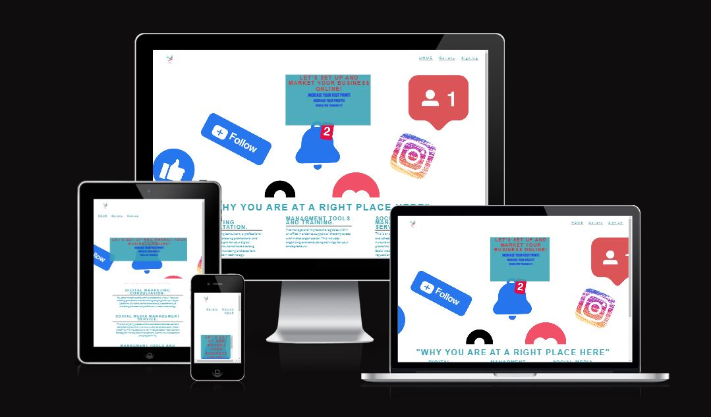

# KM Projects
KM Projeccts is an organisation that offer Digital Marketing Services.  Its goal is to help township entrepreneurs who own small business to be able to present their business in a digital space in a professional way that meets modern standards and needs at an affordable price.

Trainning for business owners on how to navigate, manage their businesses online and social media platforms and other useful online tools that are used today in their native langauges.
### DIGITAL MARKETING CONSULTATION.
You get a marketing consultant, a professional who will focus on creating promotional and advertising campaigns for your digital platforms. Our consultants have a strong understanding of marketing and excellent proficiency in modern technology.
### MANAGMENT TOOLS AND TRAINING.
We manage and improve the logistics within an office in order to support all the employees within that organization. This includes organising and conducting trainings for your entrepreneurs.  Additionally there is a free training for a randomly selected Enterprenuers that signed up.
### SOCIAL MEDIA MANAGEMENT SERVICE.
This is an ongoing process where we create and schedul content designed to grow and nurture an audience acreoss social media platforms. This includes but is not limited to: Social media content strategy.Online reputation managment. Community management and programming.

## Features
### Navigation Bar
