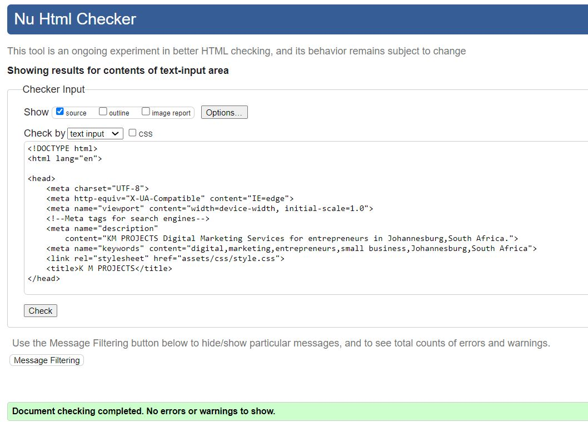

# KM Projects
KM Projeccts is an organisation that offer Digital Marketing Services.  Its goal is to help township entrepreneurs who own small business to be able to present their business in a digital space in a professional way that meets modern standards and needs at an affordable price.

Trainning for business owners on how to navigate, manage their businesses online and social media platforms and other useful online tools that are used today in their native langauges.
### DIGITAL MARKETING CONSULTATION.
You get a marketing consultant, a professional who will focus on creating promotional and advertising campaigns for your digital platforms. Our consultants have a strong understanding of marketing and excellent proficiency in modern technology.
### MANAGMENT TOOLS AND TRAINING.
We manage and improve the logistics within an office in order to support all the employees within that organization. This includes organising and conducting trainings for your entrepreneurs.  Additionally there is a free training for a randomly selected Enterprenuers that signed up.
### SOCIAL MEDIA MANAGEMENT SERVICE.
This is an ongoing process where we create and schedul content designed to grow and nurture an audience acreoss social media platforms. This includes but is not limited to: Social media content strategy.Online reputation managment. Community management and programming.

## Features
### Navigation Bar

The Navigation bar appeares in all three pages, the full responsive navigation bar includes links to the Logo, Home page, Gallery and Sign Up page and is exactly the same in each page to allow for easy navigation.
It helps the user to navigate from one page to another across all devices. 

### Landing section

The landing section contains a photograph with text overlay that is transparent with a clear message of what KM projects is doing for the interprenues.  
That is set and help them up on social media increase to increase their presence and therefore profits.

### Main Content Section

The main content section explains the how of the website. Deals of the serves included. Explains that the business will set you up on vareous social media platforms,
 run promotional and advirtising compaigns for you and training you on the same in your mother tounge if you prefare and possibly and if you are lucky get the training free. 

### The Gallery page

The Gallery page shows various photos of businesses we previously helped, this will give the Enterprenuers oportunity of how their finished product, ie their facebook page,instagram page etc might look like.

### The Sign UP page

This page allow the entrepreneurs to sign up to KM Projects and to stand a chance to win free training but most importantly allows to book a service they need for their business.

### The Footer

The footer section contains the various social media links that open on a new tab to help the entrepreneurs not to get lost while navigating the site.  It helps the entrepreneurs see our work on other platforms other than from this website and helps the to connect with us in which over platform they prefare. 
 Lastly it validates that KM Prjects also users the services it is selling to the Enterprenuers.

 ## Testing

### HTML Validator - https://validator.w3.org/

 ### HTML Validation for index file:

 ### HTML Validation for gallery file:

### Fixed Bugs from HTML validation gallery file

 ### HTML Validation for Sign Up file:

### Fixed Bugs from HTML validation Sign Up file

Please note that most of the error messages have been fixed by simply deleting the white spaces as suggested by the validator.
The remaining errors are relating to the fact that the actuall receiptiant is code institute and the form is hidded.

 ### CSS Validation for index file:

###CSS VAlidator - https://jigsaw.w3.org/css-validator/

Please note that 6 errors have been fixed already see section Bugs for details.  I am leaving the warning message due to time constrains.

  ## Bugs

  ### Bugs from HTML validation gallery file

  

  This bug was fixed by simply replacing a section with a div. refere to Validation section to see snip with no warning messages anymore.

  ### Bugs from HTML validation Sign Up file

it is clear from the above snip that most of the error are comming from the white spaces between the id names. Deleting the white spaces solved the problem see sniped on the validation section above.
remaining error message are relating to the gact that I am submitting the form to codeinstitute and it is hidden.

### Bugs from CSS file:

There are six error messages to fix as stipulated by the snip.  Letter spacing des not like persentages and float require proper values.
refere to Validation section for an updated snip after the bugs are fixed.

  